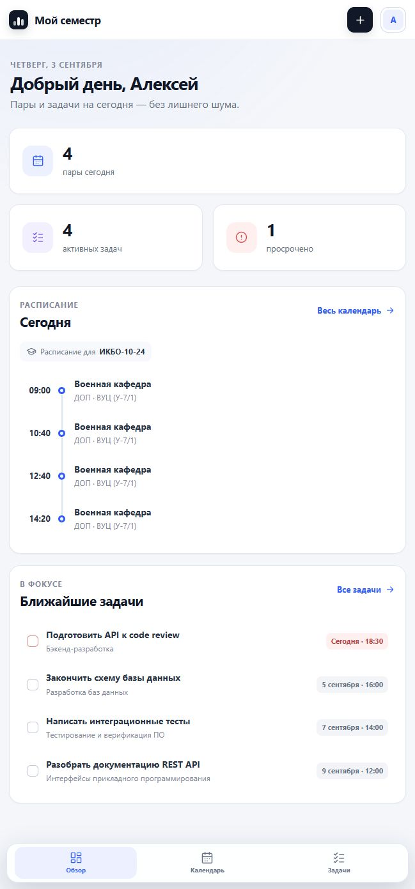
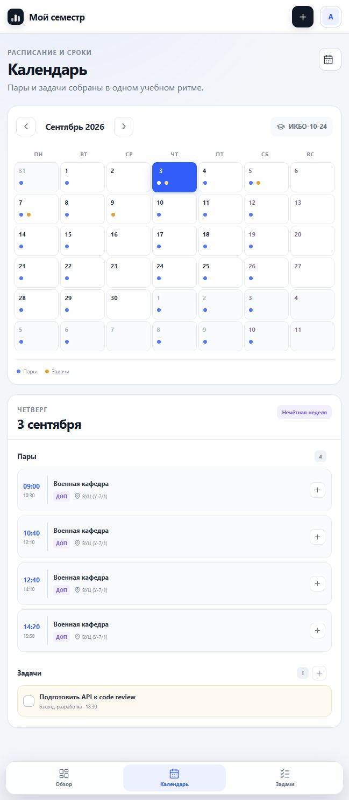
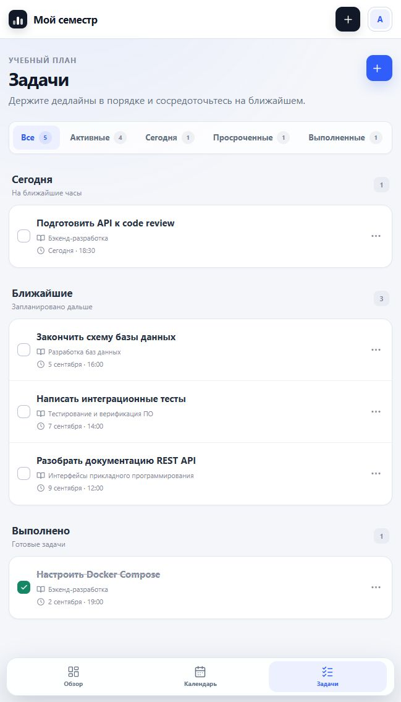

# Мой семестр

[](https://github.com/is200406moil/schedule-service-backend/actions/workflows/ci.yml)

Веб-приложение для студентов РТУ МИРЭА: показывает расписание группы и личные задачи в одном календаре.

Проект начался как курсовая работа на вузовском курсе по backend-разработке, обучение проходило на платформе Яндекс Практикума. Мне хотелось сделать не ещё один список задач, а небольшой рабочий сервис, где дедлайны связаны с реальным расписанием.

## Интерфейс

<table>
  <tr>
    <th>Обзор дня</th>
    <th>Календарь</th>
    <th>Задачи</th>
  </tr>
  <tr>
    <td></td>
    <td></td>
    <td></td>
  </tr>
</table>

## Что умеет приложение

- регистрировать пользователей и хранить их данные отдельно;
- загружать расписание выбранной группы;
- создавать задачи с предметом, сроком и статусом;
- показывать пары и дедлайны в общем календаре;
- отмечать выполненные задачи и следить за ближайшими сроками.

## Происхождение проекта и мой вклад

Для получения расписания я использовал отдельный сервис [is200406moil/rtu-mirea-schedule](https://github.com/is200406moil/rtu-mirea-schedule). Он основан на форке [0niel/rtu-mirea-schedule](https://github.com/0niel/rtu-mirea-schedule), который, в свою очередь, развивает открытый проект [RTUITLab/Schedule-RTU-API](https://github.com/RTUITLab/Schedule-RTU-API). Исходные проекты распространяются по лицензии MIT.

В своей версии сервиса расписания я заменил старый Excel-парсер на получение данных из публичного `schedule-of` API и разбор iCalendar. Также добавил повторные запросы при временных ошибках, фоновое обновление кэша и endpoint для проверки его состояния.

Этот репозиторий — отдельное приложение, которое использует API расписания. Здесь я реализовал:

- backend на FastAPI для регистрации, авторизации и задач;
- хранение пользователей и задач в PostgreSQL, миграции Alembic;
- проверку принадлежности задачи текущему пользователю;
- календарь, объединяющий расписание и личные дедлайны;
- серверный интерфейс на Jinja2 и адаптивную вёрстку;
- совместный запуск приложения, двух баз данных и сервиса расписания через Docker Compose;
- API-тесты и автоматическую проверку кода.

## Как всё связано

| Компонент | За что отвечает | Хранилище |
| --- | --- | --- |
| Основное приложение | пользователи, задачи, веб-интерфейс и единая точка доступа к расписанию | PostgreSQL |
| Сервис расписания | группы, пары, преподаватели и аудитории | MongoDB |
| Публичный источник МИРЭА | исходные данные расписания в iCalendar | — |

Браузер обращается только к основному приложению. Оно связывается с сервисом расписания по внутреннему адресу, проверяет его ответы и ограничивает время ожидания. Если расписание временно недоступно, задачи и остальные разделы продолжают работать.

## Запуск

Нужен Docker с поддержкой `docker compose`.

```bash
docker compose up --build
```

После запуска:

- приложение: <http://localhost:8000/ui>;
- API основного приложения: <http://localhost:8000/docs>;
- API расписания: <http://localhost:5000/docs>;
- проверка состояния: <http://localhost:8000/health>.

При первом запуске заполнение кэша расписания может занять несколько минут. PostgreSQL, MongoDB и оба API поднимаются одной командой; данные баз сохраняются в Docker volumes.

Остановить сервисы:

```bash
docker compose down
```

## Технологии

Python 3.12, FastAPI, SQLAlchemy, PostgreSQL, Alembic, MongoDB, Jinja2, JavaScript, Docker Compose, Pytest и Ruff.

## Проверки

```bash
python -m pip install -r requirements-dev.lock
python -m ruff check .
python -m ruff format --check app tests
python -m pytest --cov=app --cov-report=term-missing --cov-fail-under=80
```

Тесты используют отдельную SQLite-базу в памяти, поэтому для их запуска не нужен работающий PostgreSQL. CI дополнительно проверяет миграции на PostgreSQL, синтаксис браузерного JavaScript и сборку Docker-образов.

`requirements.txt` и `requirements-dev.txt` содержат допустимые диапазоны версий, а lock-файлы фиксируют проверенный набор зависимостей для Docker и CI. После изменения исходных списков их можно обновить так:

```bash
python -m piptools compile --strip-extras --output-file=requirements.lock requirements.txt
python -m piptools compile --strip-extras --output-file=requirements-dev.lock requirements-dev.txt
```

## Подробности

- [Архитектура и принятые решения](docs/architecture.md)
- [Документация сервиса расписания](https://github.com/is200406moil/rtu-mirea-schedule)

## Безопасность

- пароли хешируются с помощью Argon2;
- JWT ограничены по времени жизни, в браузере токен хранится в `HttpOnly` cookie с `SameSite=Lax` и настраиваемым флагом `Secure`;
- изменяющие данные HTML-формы и браузерные API-запросы защищены CSRF-токеном;
- повторные неудачные попытки входа временно ограничиваются;
- аватары проверяются по формату, содержимому и размеру до 2 МБ;
- ответы содержат базовые защитные HTTP-заголовки;
- все операции с задачами проверяют их принадлежность текущему пользователю;
- служебное обновление расписания защищено отдельным ключом;
- рабочие секреты передаются через переменные окружения, значения из Docker Compose предназначены только для локального запуска.
