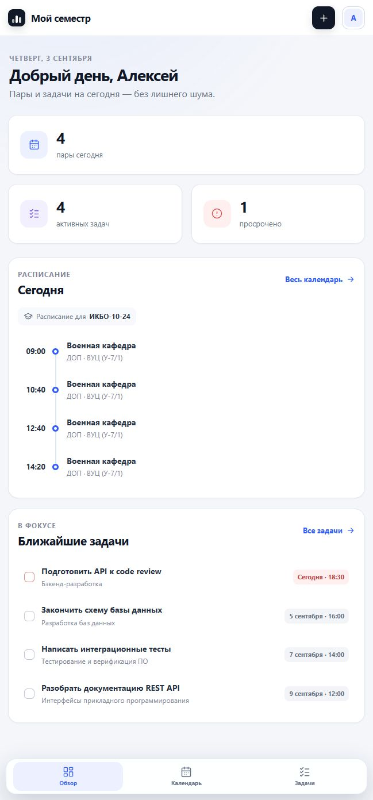
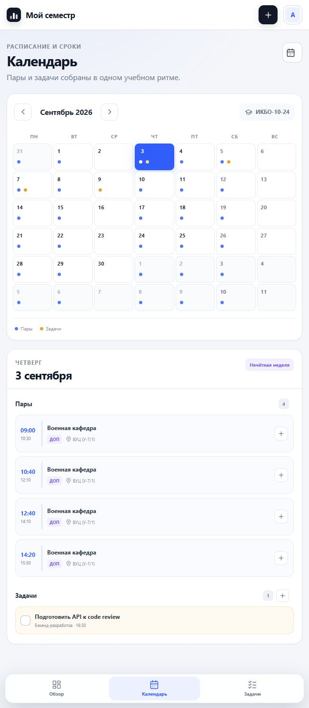
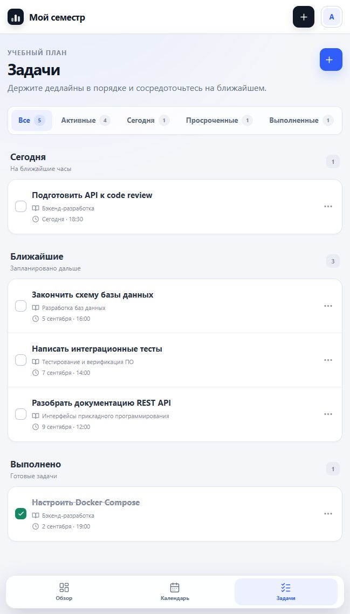

# Мой семестр

[](https://github.com/is200406moil/schedule-service-backend/actions/workflows/ci.yml)

Веб-приложение для студентов РТУ МИРЭА: показывает расписание группы и личные задачи в одном календаре.

Проект начался с курсовой работы в 6-м семестре. Курс по бэкенд-разработке проходил в РТУ МИРЭА на платформе Яндекс Практикума. Для курсовой я выбрал собственную идею: объединить расписание группы и личные дедлайны, чтобы не вести их в разных местах.

## Интерфейс

<table>
  <tr>
    <th>Обзор дня</th>
    <th>Календарь</th>
    <th>Задачи</th>
  </tr>
  <tr>
    <td></td>
    <td></td>
    <td></td>
  </tr>
</table>

Новые разделы на React и TypeScript доступны после входа: обзор — `/ui/preview`, календарь — `/ui/calendar/preview`, задачи — `/ui/tasks/preview`, профиль — `/ui/profile/preview`. В календаре можно выбрать день, посмотреть пары и задачи, создать задачу и изменить её статус. В списке задач есть фильтры, группировка по срокам, отметка выполнения и удаление с подтверждением.

Профиль сначала показывает сохранённые данные. Редактирование и выход находятся в меню аккаунта справа сверху. Личные данные, учебную группу и фотографию можно изменить на странице `/ui/profile/preview?edit=1`.

Обзор, календарь, задачи и профиль используют одно окно добавления задачи; календарь подставляет выбранную дату и предмет пары. На телефоне окно выезжает снизу, поля прокручиваются отдельно от кнопок. Свайп вниз за ручку закрывает пустую форму, а для заполненной запрашивает подтверждение. Создание и редактирование задачи по прямой ссылке открываются на отдельной React-странице. Прежние серверные страницы и формы остаются доступны для сравнения. Последовательность обновления и оставшиеся замечания записаны в [плане интерфейса](docs/ui-redesign-plan.md).

## Что умеет приложение

- регистрировать пользователей и изолировать их данные;
- загружать расписание выбранной группы;
- создавать задачи с предметом, сроком и статусом;
- показывать пары и дедлайны в общем календаре;
- отмечать выполненные задачи и следить за ближайшими сроками.

## Происхождение проекта и мой вклад

Расписание загружает отдельный сервис [is200406moil/rtu-mirea-schedule](https://github.com/is200406moil/rtu-mirea-schedule). Моя версия основана на форке [0niel/rtu-mirea-schedule](https://github.com/0niel/rtu-mirea-schedule). В основе обоих репозиториев — открытый проект [RTUITLab/Schedule-RTU-API](https://github.com/RTUITLab/Schedule-RTU-API). Исходные проекты распространяются по лицензии MIT.

В сервисе расписания я заменил Excel-парсер на получение данных из публичного `schedule-of` API и разбор iCalendar. Добавил повторные запросы при временных ошибках и буквальный поиск без выполнения пользовательских регулярных выражений. Кэш обновляется в фоне: параллельные запуски блокируются, а новые данные заменяют текущие только после загрузки всех групп.

В этом репозитории находится основное приложение. Оно использует API расписания. Здесь я реализовал:

- бэкенд на FastAPI для регистрации, авторизации и задач;
- хранение пользователей и задач в PostgreSQL, миграции Alembic;
- проверку принадлежности задачи текущему пользователю;
- календарь, объединяющий расписание и личные дедлайны;
- серверный интерфейс на Jinja2 и адаптивную вёрстку;
- совместный запуск приложения, двух баз данных и сервиса расписания через Docker Compose;
- API-тесты и автоматическую проверку кода.

## Как всё связано

| Компонент | За что отвечает | Хранилище |
| --- | --- | --- |
| Основное приложение | пользователи, задачи, веб-интерфейс и единая точка доступа к расписанию | PostgreSQL |
| Сервис расписания | группы, пары, преподаватели и аудитории | MongoDB |
| Публичный источник МИРЭА | исходные данные расписания в iCalendar | — |

Браузер обращается только к основному приложению. Приложение вызывает сервис расписания по внутреннему адресу, проверяет ответы и ограничивает время ожидания. Если сервис расписания временно недоступен, задачи и остальные разделы продолжают работать.

## Запуск

Нужен Docker с поддержкой `docker compose`.

```bash
docker compose up --build
```

После запуска:

- приложение: <http://localhost:8000/ui>;
- новый обзор для сравнения: <http://localhost:8000/ui/preview>;
- новый календарь для сравнения: <http://localhost:8000/ui/calendar/preview>;
- новый список задач для сравнения: <http://localhost:8000/ui/tasks/preview>;
- новая форма задачи для сравнения: <http://localhost:8000/ui/tasks/new/preview>;
- новый профиль для сравнения: <http://localhost:8000/ui/profile/preview>;
- API основного приложения: <http://localhost:8000/docs>;
- API расписания: <http://localhost:5000/docs>;
- проверка процесса: <http://localhost:8000/health>;
- проверка готовности приложения и PostgreSQL: <http://localhost:8000/ready>.

Первый запуск может занять несколько минут, пока сервис заполняет кэш расписания. PostgreSQL, MongoDB и оба API запускаются одной командой. Данные баз сохраняются в Docker volumes.

Остановить сервисы:

```bash
docker compose down
```

## Технологии

Python 3.12, FastAPI, SQLAlchemy, PostgreSQL, Alembic, MongoDB, Jinja2, React, TypeScript, Vite, Docker Compose, Pytest и Ruff. React пока используется в предварительных версиях обзора, календаря, списка задач, формы задачи и профиля.

## Проверки

```bash
python -m pip install -r requirements-dev.lock
python -m ruff check .
python -m ruff format --check app tests
python -m pytest --cov=app --cov-branch --cov-report=term-missing --cov-fail-under=80
cd frontend
npm ci
npm run build
npm test
```

Для локального запуска FastAPI без Docker сначала соберите интерфейс в `frontend`: результат попадёт в `app/static/react` и не хранится в Git. В Docker сборка выполняется автоматически.

Локально тесты по умолчанию используют отдельную SQLite-базу в памяти, поэтому PostgreSQL для них не нужен. В CI тот же набор тестов выполняется на PostgreSQL. Отдельные проверки охватывают миграции в обе стороны, покрытие строк и ветвлений не ниже 80%, уязвимости зависимостей, синтаксис браузерного JavaScript и запуск стека в контейнерах.

`requirements.txt` и `requirements-dev.txt` содержат допустимые диапазоны версий, а lock-файлы фиксируют проверенный набор зависимостей для Docker и CI. После изменения исходных списков их можно обновить так:

```bash
python -m piptools compile --strip-extras --output-file=requirements.lock requirements.txt
python -m piptools compile --strip-extras --output-file=requirements-dev.lock requirements-dev.txt
```

## Подробности

- [Архитектура и принятые решения](docs/architecture.md)
- [Документация сервиса расписания](https://github.com/is200406moil/rtu-mirea-schedule)

## Безопасность

- пароли хешируются с помощью Argon2;
- JWT ограничены по времени жизни, в браузере токен хранится в `HttpOnly` cookie с `SameSite=Lax` и настраиваемым флагом `Secure`;
- production-режим не запускается со слабым JWT-секретом или без `Secure` для cookie;
- изменяющие данные HTML-формы и браузерные API-запросы защищены CSRF-токеном;
- повторные неудачные попытки входа временно ограничиваются;
- ответ при входе не раскрывает, существует ли учётная запись и активна ли она;
- аватары проверяются по формату, содержимому и размеру до 2 МБ;
- страницы приложения используют строгую Content Security Policy и другие защитные HTTP-заголовки;
- все операции с задачами проверяют их принадлежность текущему пользователю;
- служебное обновление расписания защищено отдельным ключом;
- рабочие секреты передаются через переменные окружения, значения из Docker Compose предназначены только для локального запуска.
- процессы основного приложения и сервиса расписания запускаются в контейнерах без прав `root`.
