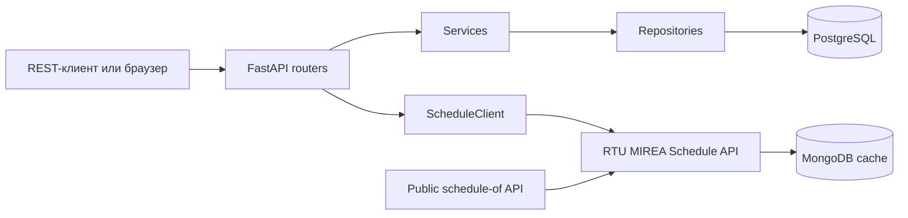

# Архитектура

## Границы модулей

- `app/core` — конфигурация, подключение к БД и общие механизмы безопасности;
- `app/models` и `app/schemas` — ORM-модели и входные/выходные схемы;
- `app/repositories` — запросы к PostgreSQL;
- `app/services` — правила приложения, не зависящие от HTTP;
- `app/routers` — REST API и HTML-маршруты, разделённые по функциональности;
- `app/web` — обработка форм, подготовка данных и общие настройки шаблонов;
- `app/templates` и `app/static` — серверные страницы и их стили/скрипты;
- `tests` — независимые группы проверок аутентификации, задач, веб-интерфейса
  и системных настроек.

Базовый шаблон загружает общие стили и оболочку приложения, а функциональные
страницы подключают только свои дополнительные CSS и JavaScript. Повторяющееся
поведение, например автодополнение полей, вынесено в общий модуль. В шаблонах
остаются разметка и небольшие JSON-конфигурации, которые сервер безопасно
передаёт клиентскому коду.

## Поток запроса



`routers` отвечают за HTTP: проверяют входные данные через Pydantic, получают текущего пользователя и формируют ответ. Правила доступа к задачам находятся в `services`. SQL-запросы собраны в `repositories`.

REST API и HTML-маршруты используют общий сервисный слой. Поэтому правила регистрации, входа, обновления профиля и доступа к задачам не дублируются в разных интерфейсах. Веб-маршруты разделены по функциональности в `app/routers/ui`, а подготовка данных для шаблонов находится в `app/web`.

Календарь получает расписание группы через маршруты основного приложения. `ScheduleClient` обращается к отдельному API по внутреннему адресу, проверяет структуру ответа и ограничивает время ожидания. Браузеру не нужно знать адрес второго сервиса или обращаться к нему напрямую. Docker Compose поднимает Schedule API вместе с MongoDB и запускает первоначальное наполнение кэша. Сервис расписания собирает новые данные во временную коллекцию и публикует их атомарно, поэтому незавершённое обновление не повреждает действующий кэш. Ошибка внешнего сервиса превращается в контролируемый ответ основного API и не блокирует работу с задачами.

## Аутентификация

После входа сервер выдаёт JWT с идентификатором пользователя в `sub`, временем выпуска в `iat` и сроком действия в `exp`. API принимает токен из заголовка `Authorization: Bearer ...`; серверный интерфейс хранит тот же токен в `HttpOnly` cookie.

Пароли не сохраняются в открытом виде: для хеширования используется Argon2.
Проверка пароля выполняется и для неизвестной почты, чтобы уменьшить разницу во
времени ответа, а ошибка входа не раскрывает состояние учётной записи. В режиме
`production` приложение требует JWT-секрет длиной не менее 32 байт и `Secure`
cookie; иначе запуск завершается ошибкой конфигурации.

## Изоляция данных

Репозиторий задач получает одновременно `task_id` и `user_id`:

```python
select(Task).where(Task.id == task_id, Task.user_id == user_id)
```

Поэтому идентификатора чужой задачи недостаточно для чтения, изменения или удаления. Это поведение отдельно проверяется API-тестом.

## Хранение данных

Основные сущности:

- `User` — учётная запись и профиль;
- `Task` — задача, принадлежащая одному пользователю.

Связь `User 1 → N Task` защищена внешним ключом с `ON DELETE CASCADE`. Изменения схемы оформлены последовательными миграциями Alembic.

## Осознанные упрощения

- синхронная SQLAlchemy-сессия подходит для размера учебного проекта;
- access token не поддерживает принудительный отзыв;
- аватар хранится как Data URL в БД, а не в объектном хранилище;
- HTML-интерфейс нужен для демонстрации сценариев, основной контракт проекта — REST API.
