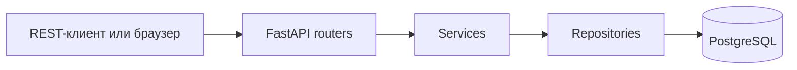

# Архитектура

## Поток запроса



`routers` отвечают за HTTP: проверяют входные данные через Pydantic, получают текущего пользователя и формируют ответ. Правила доступа к задачам находятся в `services`. SQL-запросы собраны в `repositories`.

Веб-маршруты используют те же модели и репозитории, что и REST API. Это уменьшает дублирование, хотя часть преобразования HTML-форм остаётся в `app/routers/web.py`.

## Аутентификация

После входа сервер выдаёт JWT с идентификатором пользователя в `sub` и сроком действия в `exp`. API принимает токен из заголовка `Authorization: Bearer ...`; серверный интерфейс хранит тот же токен в `HttpOnly` cookie.

Пароли не сохраняются в открытом виде: для хеширования используется Argon2. JWT-секрет передаётся через окружение.

## Изоляция данных

Репозиторий задач получает одновременно `task_id` и `user_id`:

```python
select(Task).where(Task.id == task_id, Task.user_id == user_id)
```

Поэтому идентификатора чужой задачи недостаточно для чтения, изменения или удаления. Это поведение отдельно проверяется API-тестом.

## Хранение данных

Основные сущности:

- `User` — учётная запись и профиль;
- `Task` — задача, принадлежащая одному пользователю.

Связь `User 1 → N Task` защищена внешним ключом с `ON DELETE CASCADE`. Изменения схемы оформлены последовательными миграциями Alembic.

## Осознанные упрощения

- синхронная SQLAlchemy-сессия подходит для размера учебного проекта;
- access token не поддерживает принудительный отзыв;
- аватар хранится как Data URL в БД, а не в объектном хранилище;
- HTML-интерфейс нужен для демонстрации сценариев, основной контракт проекта — REST API.
