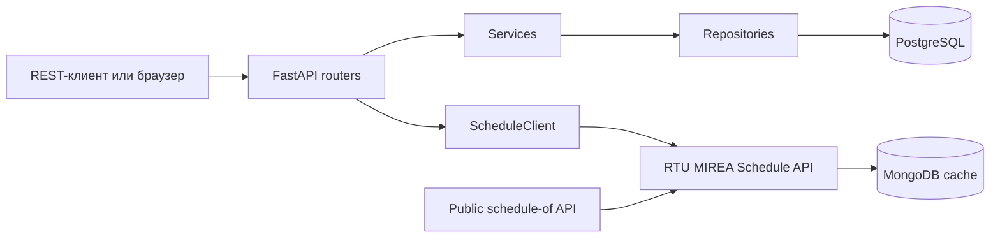

# Архитектура

## Границы модулей

- `backend/app/core` — конфигурация, подключение к БД и общие механизмы безопасности;
- `backend/app/models` и `backend/app/schemas` — ORM-модели и входные/выходные схемы;
- `backend/app/repositories` — запросы к PostgreSQL;
- `backend/app/services` — правила приложения, не зависящие от HTTP;
- `backend/app/routers` — REST API и HTML-маршруты, разделённые по функциональности;
- `backend/app/web` — обработка форм, подготовка данных и настройки шаблонов;
- `backend/app/templates` — HTML-оболочки React и ответы совместимости для старых POST-форм;
- `backend/app/static` — стили и скрипты только этих ответов совместимости;
- `backend/alembic` — миграции схемы данных;
- `frontend/src/features` — разделы auth, overview, calendar, tasks и profile;
- `frontend/src/shared` — общие компоненты, стили, типы, даты и клиент API;
- `frontend/src/entries` — все шесть точек входа, включая публичные страницы;
- `frontend/src/test` — общие помощники клиентских тестов;
- `infra/schedule` — Dockerfile отдельного API расписания и его закреплённые зависимости;
- `backend/tests` — независимые группы проверок аутентификации, задач, веб-интерфейса
  и системных настроек.

Основные GET-страницы используют `react.html`, публичные — `public.html`.
Это тонкие оболочки: контейнер React, экранированный JSON начального состояния
и ссылки на JS/CSS из Vite manifest. Разметка экранов и их стили находятся
во фронтенде. `base.html`, `profile.html` и `task_form.html` сохранены только
для ответов старых POST-форм при ошибках; обычная навигация их не открывает.

Вход, регистрация и политика находятся в `frontend/src/features/auth`.

Каждая точка входа в `entries` подключает свой раздел и необходимые стили.
`features` может использовать общие модули и возможности другого раздела,
например окно добавления задачи. `shared` не импортирует разделы из `features`.
Общие поля форм оформляются в `shared/form-fields.css`; стили отдельных страниц
и их мобильные правила принадлежат соответствующим разделам. Тесты остаются
рядом с проверяемым кодом, переиспользуемые помощники находятся в `src/test`.

Это многостраничная интеграция Vite с FastAPI, а не самостоятельное SPA.
Поэтому HTML-оболочки находятся на сервере, а `frontend/index.html` не нужен.
Сборка использует явный список точек входа и Vite manifest. `npm run dev`
наблюдает за исходниками и пересобирает `dist`; он не запускает отдельный
HTTP-сервер и не добавляет внешние скрипты в страницы.

FastAPI передаёт публичным страницам только конфигурацию, CSRF-токен и состояние формы через
экранированный JSON в `backend/app/templates/public.html`. Разметка форм,
их стили и текст политики принадлежат фронтенду. Формы отправляют обычный POST
на сервер; пароль не включается в JSON начального состояния и не сохраняется
в браузерное хранилище. Поля регистрации — почта и пароль.

React обслуживает основные адреса `/ui`, `/ui/calendar`, `/ui/tasks`,
`/ui/profile`, `/ui/tasks/new` и `/ui/tasks/{id}/edit`. После входа открывается
React-обзор, а не прежняя серверная страница. Старые GET-адреса с `/preview`
отвечают перенаправлением 308 на основной адрес, сохраняя query string.
Безопасные `return_to` нормализуются к основным адресам; внешние и неизвестные
адреса не принимаются. Навигация использует общий `shared/uiRoutes.ts`.
Интерфейс использует тот же FastAPI, cookie и маршруты `/tasks`, `/auth/me`
и `/schedule`. Календарь
показывает месяц, пары и задачи выбранного дня, а список задач группирует дела
по срокам и фильтрам. Общая оболочка содержит навигацию, один логотип и меню
аккаунта. Профиль по умолчанию показывает данные, а `?edit=1` открывает форму.
Профиль сохраняет данные через `PATCH /auth/me` с
CSRF-токеном. Личные данные и фото отправляются отдельными запросами: изменение
имени не затрагивает аватар. Ошибка подсказок групп не мешает ввести группу
вручную. Обзор, календарь, список задач и профиль используют общее окно
создания. На узком и коротком мобильном экране оно работает как нижняя панель:
заголовок принимает жест закрытия, поля прокручиваются отдельно, кнопки остаются
доступными. Заполненный черновик требует подтверждения закрытия. Его поля и
подготовка данных переиспользуются в отдельной форме
задачи. Формы создают и обновляют задачи через REST API. Старые POST-обработчики
профиля и задач сохранены для совместимости; успешный ответ возвращает уже
в React. Их ошибки валидации по-прежнему используют серверные шаблоны.
Неиспользуемые GET-шаблоны обзора, календаря и списка задач удалены.
Vite собирает шесть точек
входа в `frontend/dist`. Сервер раздаёт эту папку по `/static/react/`, без
копирования в `backend/app/static`. Имена файлов он берёт из
манифеста сборки, а браузер загружает файлы со своего же домена. Это сохраняет
действующую Content Security Policy без внешних скриптов и inline-кода.
HTML-оболочка закрытых страниц передаёт данные через `page-data`, публичная —
через `public-data`. Перенос не меняет REST-контракты и схему базы данных.

Уведомление о технических cookies используется в публичных страницах и общей
React-оболочке. Это немодальный блок без перекрытия формы: после закрытия фокус
переходит в основное содержимое. В `localStorage` сохраняется только версия
отметки о закрытии. Уведомление не является согласием на обработку всех данных
и не утверждает, что технические cookies устанавливаются только после нажатия.

Python-зависимости приложения перечислены с точными версиями в
`backend/requirements.txt`. Список для разработки подключает его, а не
повторяет зависимости сервера. Docker и локальный запуск используют один
runtime-список. npm-зависимости фиксирует `frontend/package-lock.json`, сервис
расписания имеет отдельный список в `infra/schedule/requirements.txt`.
Корневой `.env` читается независимо от текущей рабочей папки.

## Поток запроса


```mermaid
flowchart LR
    Client[REST-клиент или браузер]
    Router[FastAPI routers]
    Service[Services]
    Repository[Repositories]
    DB[(PostgreSQL)]
    ScheduleClient[ScheduleClient]
    ScheduleAPI[RTU MIREA Schedule API]
    ScheduleDB[(MongoDB cache)]
    Source[Public schedule-of API]

    Client --> Router
    Router --> Service
    Service --> Repository
    Repository --> DB
    Router --> ScheduleClient
    ScheduleClient --> ScheduleAPI
    ScheduleAPI --> ScheduleDB
    Source --> ScheduleAPI
```

`routers` отвечают за HTTP: проверяют входные данные через Pydantic, получают текущего пользователя и формируют ответ. Правила доступа к задачам находятся в `services`. SQL-запросы собраны в `repositories`.

REST API и HTML-маршруты используют общий сервисный слой. Поэтому правила регистрации, входа, обновления профиля и доступа к задачам не дублируются в разных интерфейсах. Веб-маршруты разделены по функциональности в `backend/app/routers/ui`, а подготовка данных для шаблонов находится в `backend/app/web`.

Календарь получает расписание группы через маршруты основного приложения. `ScheduleClient` обращается к отдельному API по внутреннему адресу, проверяет структуру ответа и ограничивает время ожидания. Браузеру не нужно знать адрес второго сервиса или обращаться к нему напрямую. Docker Compose поднимает Schedule API вместе с MongoDB и запускает первоначальное наполнение кэша. Сервис расписания собирает новые данные во временную коллекцию и публикует их атомарно, поэтому незавершённое обновление не повреждает действующий кэш. Ошибка внешнего сервиса превращается в контролируемый ответ основного API и не блокирует работу с задачами.

`/health` служит быстрой проверкой процесса, а `/ready` подтверждает доступность
PostgreSQL. Контейнер основного приложения использует `/ready`, поэтому не
считается готовым, если не может обслуживать запросы к данным.

## Аутентификация

После входа сервер выдаёт JWT с идентификатором пользователя в `sub`, временем выпуска в `iat` и сроком действия в `exp`. API принимает токен из заголовка `Authorization: Bearer ...`; серверный интерфейс хранит тот же токен в `HttpOnly` cookie.

JWT также содержит `auth_version`. Обязательная и необязательная зависимости
проверяют эту версию по пользователю в базе. При восстановлении пароля или
подтверждении почты версия
увеличивается, поэтому выданные прежде токены перестают работать. Старые JWT
без этого поля тоже не принимаются после обновления; аккаунты и задачи сохраняются.

Подтверждение почты использует `email_verification_tokens`. Ссылка действует
24 часа; запись содержит хеш токена, адрес и версию пользователя на момент
выдачи. Адрес, активность и версия проверяются при подтверждении. Статус
`users.email_verified_at` у старых аккаунтов после миграции остаётся пустым.
При `MAIL_MODE=local` или `smtp` вход и обе зависимости доступа требуют
подтверждения; при `disabled` учебная версия разрешает вход, не меняя статус.
О неправильном пароле ответ остаётся общим; о неподтверждённом адресе сообщается
только после проверки правильного пароля. Подтверждение не создаёт сессию.

Восстановление использует отдельный сервис и таблицу `password_reset_tokens`.
В таблице находится SHA-256 случайного токена, а не ссылка из письма.
Срок действия — 30 минут. Смена пароля, увеличение версии пользователя,
погашение токена и остальных ссылок выполняются в одной транзакции.
Условное обновление версии пользователя защищает и от одновременного
использования разных ссылок одного аккаунта. Подтверждение почты и смена пароля
сначала условно обновляют пользователя, затем погашают ссылку: одинаковый порядок
блокировок защищает от гонки этих действий. Оба отзывают другие ссылки обоих
типов и старые сессии. Восстановление не ставит статус подтверждённой почты.

Запрос письма отвечает одинаково для известного и неизвестного адреса.
Поиск пользователя и отправка выполняются фоновой задачей с отдельной
SQLAlchemy-сессией. Это задача внутри процесса, не долговечная очередь:
падение процесса может прервать доставку. Для нескольких процессов нужен
общий лимитер; ограничения по IP и адресу сейчас хранятся в памяти.

Веб-формы находятся во фронтенде, сервер обслуживает `/ui/forgot-password`
и `/ui/password-reset`, подтверждение — `/ui/email-verification` и
`/ui/verify-email`. Токен передаётся в URL-фрагменте, который не попадает
в HTTP-запрос; React помещает его в тело POST формы. GET не меняет пароль
и не погашает ссылку. GET подтверждения также ничего не меняет: требуется
кнопка и POST с CSRF. После успеха redirect явно очищает fragment. Страницы
запрещают кеширование и передачу Referer.
В JSON состояния формы токен и пароли не включаются.

SMTP-отправитель использует стандартную библиотеку Python и TLS с проверкой
сертификата. Для разработки есть `.eml`-отправитель в `.local/mail`, исключённой
из Git и Docker-контекста и не раздаваемой веб-сервером. По умолчанию почта
отключена, local-режим в production запрещён. После смены пароля отправляется
уведомление без нового пароля; неудача уведомления не отменяет уже выполненную смену.

Пароли не сохраняются в открытом виде: для хеширования используется Argon2.
Проверка пароля выполняется и для неизвестной почты, чтобы уменьшить разницу во
времени ответа, а ошибка входа не раскрывает состояние учётной записи. В режиме
`production` приложение требует JWT-секрет длиной не менее 32 байт и `Secure`
cookie; иначе запуск завершается ошибкой конфигурации.

## Изоляция данных

Репозиторий задач получает одновременно `task_id` и `user_id`:

```python
select(Task).where(Task.id == task_id, Task.user_id == user_id)
```

Поэтому идентификатора чужой задачи недостаточно для чтения, изменения или удаления. Это поведение отдельно проверяется API-тестом.

## Хранение данных

Основные сущности:

- `User` — учётная запись и профиль;
- `Task` — задача, принадлежащая одному пользователю.

Связь `User 1 → N Task` защищена внешним ключом с `ON DELETE CASCADE`. Изменения схемы оформлены последовательными миграциями Alembic.

## Осознанные упрощения

- синхронная SQLAlchemy-сессия подходит для размера учебного проекта;
- старые access token отзываются при сбросе пароля и подтверждении почты;
  управления отдельными сессиями в интерфейсе пока нет;
- ограничитель попыток входа хранит состояние внутри одного процесса; для нескольких экземпляров его нужно вынести в общее хранилище, например Redis;
- аватар хранится как Data URL в БД, а не в объектном хранилище;
- HTML-интерфейс нужен для демонстрации сценариев, основной контракт проекта — REST API.
